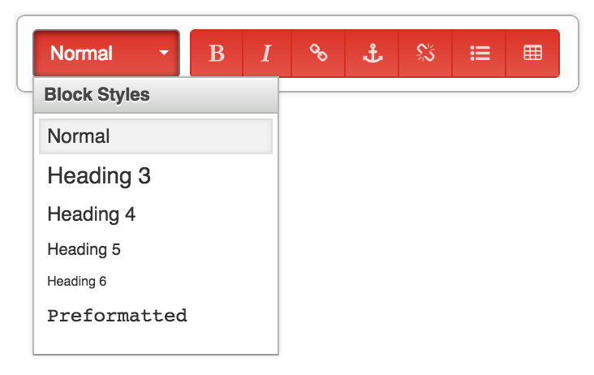

<!-- Working With Real Content
- Working with aposArea
- Working with aposSingleton
- Creating Custom Widgets (schema widgets)
 -->


## Working with Real Content

In the last tutorial we learned how to add new page templates to our document. The next step is to plug in Apostrophe's content editing tools so that our users have control over the content of their pages. It all starts with "editable areas".

### What is an "editable area"?

An editable area, or _area_ for short, is a spot on the page where our user can add their own content. When you are logged in your editable area will have an "Add Content" button at the top of it containing one or more "widgets". Widgets include text, slideshows, video embeds, downloadable files, raw HTML input, and more. We can also make our own widgets and add them to this menu, which we will do later in this tutorial.

You can have as many editable areas as you want on a page and each one can be configured individually. You can provide a list of the allowed widgets and you can pass options into most widgets to further customize their behavior.

### Using `aposArea`

##### `aposArea(page, 'name' [, options])`

The `aposArea` function takes a reference to the current page, which on a regular page template is `page`, and a unique name for the area as a string. The third `options` argument is not required.

In your page template, simply add the following:

```markup
{{ aposArea(page, 'myArea') }}
```

Restart your server, add a new page on your site, and make sure you're logged in. You should see an "Add Content" button.

[screenshot]

The `controls` option allows us to determine what widgets are included. It also determines how many controls are available in the rich text editor.

```markup
{{ aposArea(page, 'myArea', {
  controls: [ 'style', 'bold', 'italic', 'slideshow', 'video' ]
}) }}
```

#### Rich text controls

Apostrophe uses [CKEditor](http://ckeditor.com/) to allow in-context editing of text. We can pass options to the `controls` array that dictate which CKEditor buttons to show.

* `style`: the style menu, which offers heading levels, etc.
* `bold` and `italic`: you know what these are!
* `createLink`: allows the user to add a hyperlink.
* `unlink`: breaks a hyperlink.
* `insertUnorderedList`: creates a bulleted list (a `ul` element).
* `insertTable`: creates an HTML table.

You may also [insert any standard CKEditor toolbar control](http://ckeditor.com/forums/CKEditor/Complete-list-of-toolbar-items).

#### Widgets

Here's a list of widgets available in Apostrophe. Users can add these to any content area to pull in content from other places on the site and elsewhere, display slideshows and so on.

* `slideshow`: lets the user select one or more images.
* `buttons`: much like the slideshow, but suitable for creating links.
* `video`: allows video from YouTube, Vimeo and other sites to be easily embedded.
* `files`: allows the user to download files.
* `pullquote`: a "pull quote" displayed to the side of the text.
* `html`: the raw HTML widget. We do not recommend giving your users access to this unless absolutely necessary, as it can easily break your page design.

#### Configuring rich text controls



The default text style controls located in the left-hand dropdown menu of the rich text editor include:

- "Normal" (a `<p>` tag)
- "Headings" 3 - 6 (representing `<h3>` through `<h6>`)
- "Preformatted" (`<pre>`)

Depending on the requirements of your design this might be too much control for a given area. We can use the `styles` option to specify which block-level elements to use and what their names should be in the menu.

```markup
{{ aposArea(page, 'myArea', {
  styles: [
    { value: 'p', label: 'Text' },
    { value: 'h3', label: 'Title' }
  ]
}) }}
```

[screenshot of this version of the menu]

#### Adding custom classes in rich text styles

To make writing CSS for your editable text areas a bit easier you can specify classes for each of the `styles` options. When the style is used, the final tag will always have the class applied to it.

```markup
{{ aposArea(page, 'myArea', {
  styles: [
    { value: 'p',  label: 'Text',  attributes: { class: 'red' } },
    { value: 'h3', label: 'Title', attributes: { class: 'large-title' } }
  ]
}) }}
```

Now when we type in some text, the markup generated by CKEditor will look like this:

```markup
<p class="red">This is text written using the "Text" style.</p>
<h3 class="large-title">This text uses the "Title" style.</h3>
```

This takes care of the frontend, but we still need to set some configuration in `app.js`. This is because Apostrophe uses [`sanitizeHtml`](https://github.com/punkave/sanitize-html) to take any unwanted (and potentially harmful) html out of the content.

In `app.js` we need to tell `sanitizeHtml` to allow specific classes through:

```javascript
sanitizeHtml: {
  allowedClasses: {
    'p': ['red'],
    'h3': ['large-title']
  }
}
```